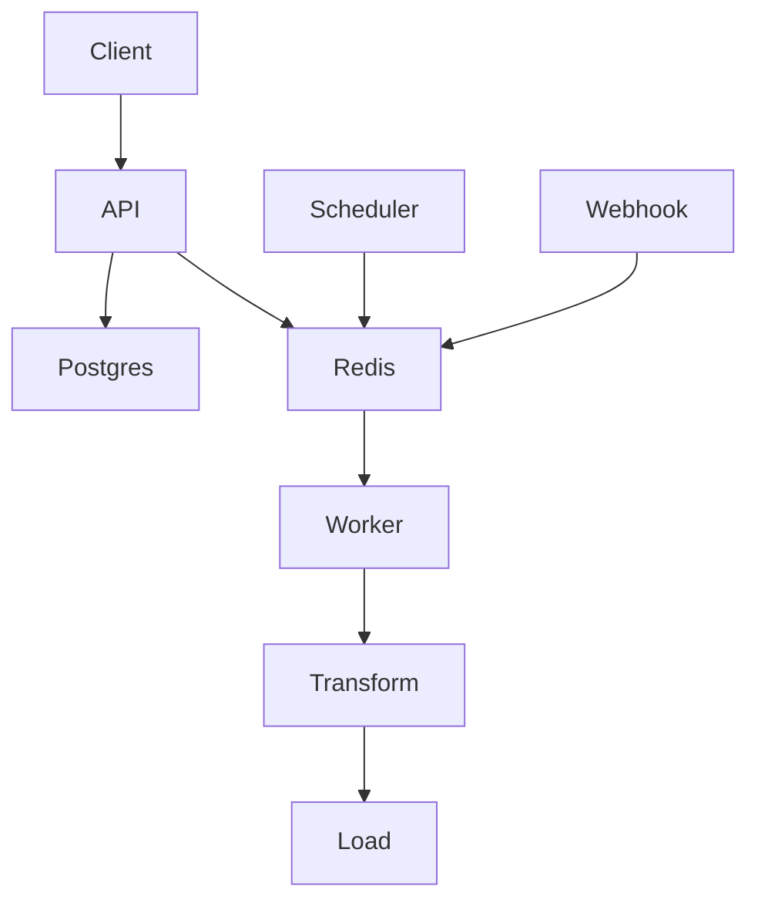

# Claricore Connectors

<p align="center">
  
  
  
  
  
  
</p>

Open-source data connector framework for building scalable ETL pipelines and integrations across enterprise systems.

## Local development

### Prerequisites

- Node.js 20+
- pnpm 9+
- Docker + Docker Compose (for local Postgres/Redis)
- `jq` (used by `scripts/smoke-test.sh`)

### Quick start

```bash
cp .env.example .env
docker compose up -d
pnpm install
pnpm db:migrate
pnpm dev
```

### Core commands

```bash
pnpm install         # install dependencies
pnpm db:migrate      # run db migrations
pnpm dev             # run all apps in dev mode via turbo
pnpm test            # run vitest suites via turbo
pnpm lint            # run eslint across workspaces
pnpm build           # build all packages/apps
pnpm validate:manifests
```

### Health endpoints

- API: `GET http://localhost:4000/health`
- Webhook gateway: `GET http://localhost:4100/health`
- Worker: `GET http://localhost:4200/health`
- Scheduler: `GET http://localhost:4300/health`

### Smoke test

After services are up:

```bash
bash scripts/smoke-test.sh
```

## Architecture



See `docs/ARCHITECTURE.md` for a detailed version.
